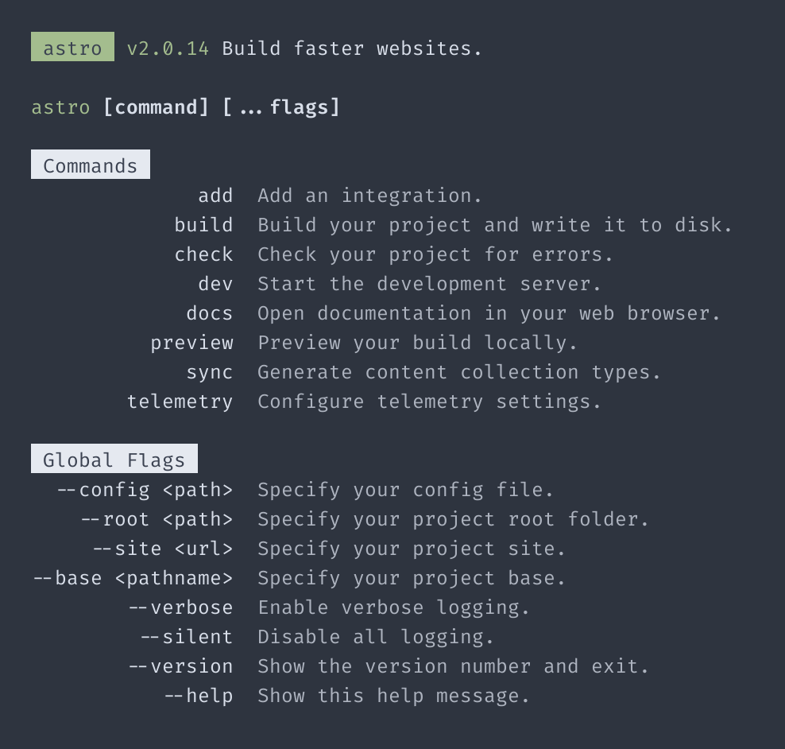

# Cloning Astro's help text

> [Astro](https://astro.build/) is an all-in-one web framework for building fast, content-focused websites.

We can view Astro's CLI help text by running `npx astro --help`.

<br>

<p align="center">
	
</p>

## `help` implementation

You may notice that Astro's table has some unique features which include a right
aligned column and two slightly different colors of text. Here's one possible way to recreate this using `help`.

```ts
import { bgGreen, bgWhite, black, bold, dim, green } from 'kleur/colors'

import { help, heading, paragraph, space, table } from '@theurgi/help'
import type { TableOptions } from '@theurgi/help'

/**
 * aTable = "Astro table"
 *
 * Extending the built-in `table` generator.
 */
const aTable: typeof table = (data: [string, string][], options?: Partial<TableOptions>) => {
  // Options common to all Astro tables
  const astroOptions: Partial<TableOptions> = {
    leftColAlign: 'right',
  }

  // Merge common options with instance options
  const astroInstanceOptions = { ...astroOptions, ...options }

  // Map over table data coloring the right column
  const coloredData: [string, string][] = data.map((row) => {
    const [leftCol, rightCol] = row
    return [leftCol, dim(rightCol)]
  })

  return table(coloredData, astroInstanceOptions)
}

/**
 * aHeading = "Astro heading"
 *
 * Extending the built-in `heading` generator.
 */
const aHeading = (text: string) => heading(bgWhite(black(` ${text.trim()} `)))

console.log(
  help({
    display: [
      space(),
      paragraph(`${bgGreen(black(' astro '))} ${green('v2.0.14')} Build faster websites.`),
      space(),

      paragraph(`${green('astro')} ${bold('[command]')} ${bold('[...flags]')}`),
      space(),

      aHeading('Commands'),
      aTable(
        [
          ['add', 'Add an integration.'],
          ['build', 'Build your project and write it to disk.'],
          ['check', 'Check your project for errors.'],
          ['dev', 'Start the development server.'],
          ['docs', 'Open documentation in your web browser.'],
          ['preview', 'Preview your build locally.'],
          ['sync', 'Generate content collection types.'],
          ['telemetry', 'Configure telemetry settings.'],
        ],
        { indentLevel: 4 }
      ),
      space(),

      aHeading('Global Flags'),
      aTable(
        [
          ['--config <path>', 'Specify your config file.'],
          ['--root <path>', 'Specify your project root folder.'],
          ['--site <url>', 'Specify your project site.'],
          ['--base <pathname>', 'Specify your project base.'],
          ['--verbose', 'Enable verbose logging.'],
          ['--silent', 'Disable all logging.'],
          ['--version', 'Show the version number and exit.'],
          ['--help', 'Show this help message.'],
        ],
        { indentLevel: 0 }
      ),
    ],
  })
)
```
