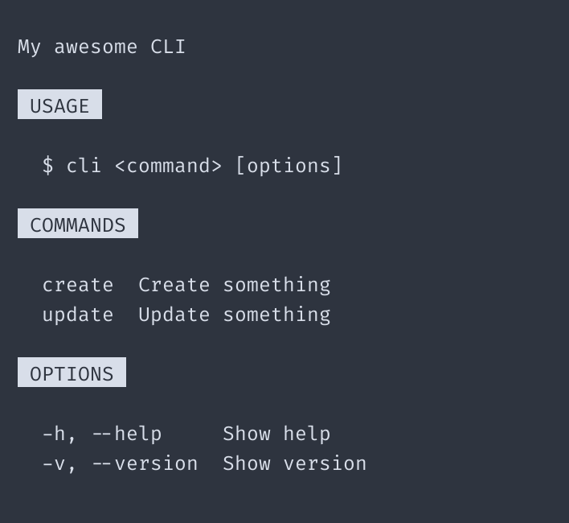

# Extending built-in Generators

In this example we'll extend the built-in `heading` `Generator` to render uppercase text with a
padded, colored background. Extending built-ins is useful for customization, reuse, and portability.

<br>

<p align="center">
	
</p>

<p align="center">
  Example results
</p>

<br>

## Import modules

First we'll import `help` along with its built-in Generators and [chalk](https://github.com/chalk/chalk) for coloring.

```ts
import chalk from 'chalk'
import { help, heading, paragraph, space, table } from '@theurgi/help'
```

## Extending the `heading` Generator

Next, we'll define a function `myHeading` which can accept any arguments, but in this case only one:
`text`. `myHeading` will "wrap" `heading` to apply our desired modifications to the `text` before
passing it to `heading`.

The only rule for extending a built-in is that the extending function ( `myHeading` ) should return the
`RenderFunction` that is returned by calling the built-in being extended ( `heading` ).

```ts
const myHeading = (text: string) => {
  text = text.toUpperCase().trim()
  return heading(chalk.inverse(` ${text} `))
}
```

## Using our extended Generator

Now we can simply use `myHeading` just as any built-in Generator.

```ts
console.log(
  help({
    display: [
      space(),
      paragraph('My awesome CLI'),
      space(),

      myHeading('usage'),
      space(),

      paragraph('$ cli <command> [options]', { indentLevel: 1 }),
      space(),

      myHeading('commands'),
      space(),

      table([
        ['create', 'Create something'],
        ['update', 'Update something'],
      ]),
      space(),

      myHeading('Options'),
      space(),

      table([
        ['-h, --help', 'Show help'],
        ['-v, --version', 'Show version'],
      ]),
    ],
  })
)
```
