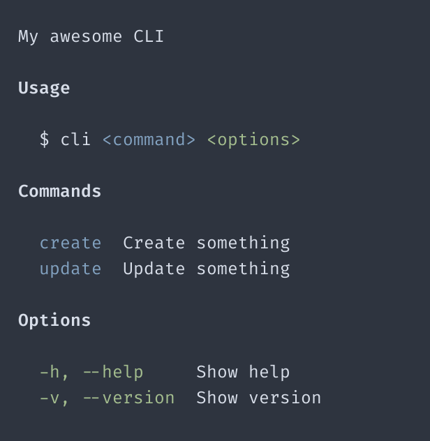

# Using chalk for colored help text

[chalk](https://github.com/chalk/chalk) is a popular JavaScript library for styling text in the
terminal. It's very easy to use with `help`.

<br>

<p align="center">
	
</p>

<p align="center">
  Example results
</p>

<br>

## Example

```ts
import chalk from 'chalk'
import { help, heading, paragraph, space, table } from '../../src/main'

const { blue, bold, green } = chalk

console.log(
  help({
    display: [
      space(),

      paragraph('My awesome CLI'),
      space(),

      heading(bold('Usage')),
      space(),

      paragraph(`$ cli ${blue('<command>')} ${green('<options>')}`, { indentLevel: 1 }),
      space(),

      heading(bold('Commands')),
      space(),

      table([
        [blue('create'), 'Create something'],
        [blue('update'), 'Update something'],
      ]),
      space(),

      heading(bold('Options')),
      space(),

      table([
        [green('-h, --help'), 'Show help'],
        [green('-v, --version'), 'Show version'],
      ]),
    ],
  })
)
```
